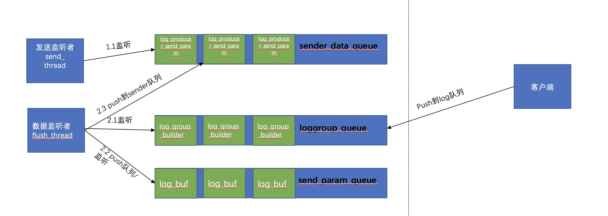

# cls log service ios sdk

## 功能特点

* 异步
    * 异步写入，客户端线程无阻塞
* 聚合&压缩 上传
    * 支持按超时时间、日志数、日志size聚合数据发送
    * 支持lz4压缩
* 缓存
    * 支持缓存上限可设置
    * 超过上限后日志写入失败


- 核心上报架构



## oc 配置说明

### import

```
#import <TencentCloudLogProducer.h>
```

### Podfile

```objective-c
pod 'TencentCloudLogProducer/Core', '1.1.3'
```

### 配置

| 参数                         | 说明                                                         |                             取值                             |
| ---------------------------- | ------------------------------------------------------------ | :----------------------------------------------------------: |
| topic                        | 日志主题 ID ，通过接口SetClsTopic设置                           | 可在控制台获取https://console.cloud.tencent.com/cls/logset/desc |
| accessKeyId                  | 访问密钥ID，通过接口setAccessKeyId设置                       | 密钥信息获取请前往[密钥获取](https://console.cloud.tencent.com/cam/capi)。并请确保密钥关联的账号具有相应的[SDK上传日志权限](https://cloud.tencent.com/document/product/614/68374#.E4.BD.BF.E7.94.A8-api-.E4.B8.8A.E4.BC.A0.E6.95.B0.E6.8D.AE) |
| accessKey                    | 访问密钥Key，通过接口setAccessKeySecret设置                  | 密钥信息获取请前往[密钥获取](https://console.cloud.tencent.com/cam/capi)。并请确保密钥关联的账号具有相应的[SDK上传日志权限](https://cloud.tencent.com/document/product/614/68374#.E4.BD.BF.E7.94.A8-api-.E4.B8.8A.E4.BC.A0.E6.95.B0.E6.8D.AE) |
| endpoint                     | 地域信息。通过接口setEndpoint设置                            | 参考官方文档：https://cloud.tencent.com/document/product/614/18940 |
| logBytesPerPackage           | 缓存的日志包的大小上限，取值为1~5242880，单位为字节。默认为1024 * 1024。通过SetClsPackageLogBytes接口设置 |                        整数，单位字节                        |
| logCountPerPackage           | 缓存的日志包中包含日志数量的最大值，取值为1~10000，默认为1024条。通过SetPackageLogCount接口设置 |                             整数                             |
| packageTimeoutInMS           | 日志的发送逗留时间，如果缓存超时，则会被立即发送，单位为毫秒，默认为3000。通过SetClsPackageTimeout接口设置 |                        整数，单位毫秒                        |
| maxBufferBytes               | 单个Producer Client实例可以使用的内存的上限，超出缓存时add_log接口会立即返回失败。通过接口SetClsMaxBufferLimit设置 |                        整数，单位字节                        |
| sendThreadCount              | 发送线程数，默认为1。通过接口SetClsSendThreadCount设置          |                             整数                             |
| connectTimeoutSec            | 网络连接超时时间，默认为60s。通过接口SetClsConnectTimeoutSec设置 |                         整数，单位秒                         |
| sendTimeoutSec               | 读写超时，默认为60s。通过接口SetClsSendTimeoutSec设置           |                         整数，单位秒                         |
| destroyFlusherWaitTimeoutSec | flusher线程销毁最大等待时间，默认为1s。通过接口SetClsDestroyFlusherWaitSec设置 |                         整数，单位秒                         |
| destroySenderWaitTimeoutSec  | sender线程池销毁最大等待时间，默认为1s。通过接口SetClsDestroySenderWaitSec设置 |                         整数，单位秒                         |
| compressType                 | 数据上传时的压缩类型，默认为LZ4压缩，默认为1s。通过接口SetClsCompressType设置 |                0 不压缩，1 LZ4压缩， 默认为1                 |
| persistent                 | 是否开启断点续传功能。通过接口SetPersistent设置 |                0 关闭(默认)，1 开启                 |
| persistentFilePath                 | 持久化的文件名，需保证文件所在的文件夹已创建。通过接口SetPersistentFilePath设置 |                                 |
| persistentMaxFileCount                 | 持久化文件个数。通过接口SetPersistentMaxFileCount设置 |        至少10个,默认10                |
| persistentMaxFileSize                 | 每个持久化文件的大小，单位为Byte。通过接口SetPersistentMaxFileSize设置 |                单位为Byte,最少1M,默认1M                |
| persistentMaxLogCount                 | 数本地最多缓存的日志数量。通过接口SetPersistentMaxLogCount设置 |                不建议超过1048576，最少65536条,默认为65536                 |
| clsretries                 | 重试次数。通过接口SetClsRetries设置 |                -1:永久重试 0:不重试                 |

### 使用demo


```objective-c
NSString* endpoint = @"project's_endpoint";
NSString* accesskeyid = @"your_accesskey_id";
NSString* accesskeysecret = @"your_accesskey_secret";
NSString* topic_id = @"your_topic";

    ClsLogProducerConfig *config = [[ClsLogProducerConfig alloc] initWithCoreInfo:[endpoint] accessKeyID:[accesskeyid] accessKeySecret:[accesskeysecret];
    [config SetClsTopic:topic_id];
    [config SetClsPackageLogBytes:1024*1024];
    [config SetPackageLogCount:1024];
    [config SetClsPackageTimeout:1000];
    [config SetClsMaxBufferLimit:64*1024*1024];
    [config SetClsSendThreadCount:1];
    [config SetClsConnectTimeoutSec:60];
    [config SetClsSendTimeoutSec:60];
    [config SetClsDestroyFlusherWaitSec:1];
    [config SetClsDestroySenderWaitSec:1];
    [config SetClsCompressType:1];
        
        //callback若传入空则不会回调
    ClsLogProducerClient *client; = [[ClsLogProducerClient alloc] initWithClsLogProducer:config callback:nil];
        ClsLog* log = [[ClsLog alloc] init];
    [log PutClsContent:@"cls_key_1" value:@"cls_value_1"];
    [log PutClsContent:@"cls_key_1" value:@"cls_value_2"];
    ClsLogProducerResult result = [client PostClsLog:log];
```

## swift配置说明

### import

```swift
import TencentCloudLogProducer
```

### Podfile

```swift
pod 'TencentCloudLogProducer/Core'
```

### 配置

| 参数                         | 说明                                                         |                             取值                             |
| ---------------------------- | ------------------------------------------------------------ | :----------------------------------------------------------: |
| topic                        | 日志主题 ID ，通过接口SetClsTopic设置                           | 可在控制台获取https://console.cloud.tencent.com/cls/logset/desc |
| accessKeyId                  | 访问密钥ID，通过接口setAccessKeyId设置                       | 密钥信息获取请前往[密钥获取](https://console.cloud.tencent.com/cam/capi)。并请确保密钥关联的账号具有相应的[SDK上传日志权限](https://cloud.tencent.com/document/product/614/68374#.E4.BD.BF.E7.94.A8-api-.E4.B8.8A.E4.BC.A0.E6.95.B0.E6.8D.AE) |
| accessKey                    | 访问密钥Key，通过接口setAccessKeySecret设置                  | 密钥信息获取请前往[密钥获取](https://console.cloud.tencent.com/cam/capi)。并请确保密钥关联的账号具有相应的[SDK上传日志权限](https://cloud.tencent.com/document/product/614/68374#.E4.BD.BF.E7.94.A8-api-.E4.B8.8A.E4.BC.A0.E6.95.B0.E6.8D.AE) |
| endpoint                     | 地域信息。通过接口setEndpoint设置                            | 参考官方文档：https://cloud.tencent.com/document/product/614/18940 |
| logBytesPerPackage           | 缓存的日志包的大小上限，取值为1~5242880，单位为字节。默认为1024 * 1024。通过SetClsPackageLogBytes接口设置 |                        整数，单位字节                        |
| logCountPerPackage           | 缓存的日志包中包含日志数量的最大值，取值为1~10000，默认为1024条。通过SetPackageLogCount接口设置 |                             整数                             |
| packageTimeoutInMS           | 日志的发送逗留时间，如果缓存超时，则会被立即发送，单位为毫秒，默认为3000。通过SetClsPackageTimeout接口设置 |                        整数，单位毫秒                        |
| maxBufferBytes               | 单个Producer Client实例可以使用的内存的上限，超出缓存时add_log接口会立即返回失败。通过接口SetClsMaxBufferLimit设置 |                        整数，单位字节                        |
| sendThreadCount              | 发送线程数，默认为1。通过接口SetClsSendThreadCount设置          |                             整数                             |
| connectTimeoutSec            | 网络连接超时时间，默认为10s。通过接口SetClsConnectTimeoutSec设置 |                         整数，单位秒                         |
| sendTimeoutSec               | 读写超时，默认为15s。通过接口SetClsSendTimeoutSec设置           |                         整数，单位秒                         |
| destroyFlusherWaitTimeoutSec | flusher线程销毁最大等待时间，默认为1s。通过接口SetClsDestroyFlusherWaitSec设置 |                         整数，单位秒                         |
| destroySenderWaitTimeoutSec  | sender线程池销毁最大等待时间，默认为1s。通过接口SetClsDestroySenderWaitSec设置 |                         整数，单位秒                         |
| compressType                 | 数据上传时的压缩类型，默认为LZ4压缩，默认为1s。通过接口SetClsCompressType设置 |                0 不压缩，1 LZ4压缩， 默认为1                 |

### 使用demo

```
//创建配置信息
let config = ClsLogProducerConfig(coreInfo:"your endpoint", accessKeyID:"your accessKeyID", accessKeySecret:"your accessKeySecret")!
config.SetClsTopic(utils.topic)
config.SetClsPackageLogBytes(1024*1024)
config.SetClsPackageLogCount(1024)
config.SetClsPackageTimeout(1000)
config.SetClsMaxBufferLimit(64*1024*1024)
config.SetClsSendThreadCoun(1)
config.SetClsConnectTimeoutSec(10)
config.SetClsSendTimeoutSec(10)
config.SetClsDestroyFlusherWaitSec(1)
config.SetClsDestroySenderWaitSec(1)
config.SetClsCompressType(1)
let tv = self.resText;

//构建client
client = ClsLogProducerClient(clsLogProducer:config, callback:callbackFunc)
```

## 网络探测

### import

```objective-c
#import "ClsNetworkDiagnosis.h"
#import "ClsAdapter.h"
#import "ClsNetDiag.h"
```

- ClsNetworkDiagnosis.h 网络探测核心功能入口文件
- ClsAdapter.h 插件管理器
- ClsNetDiag.h 网络探测output输出文件，用户可自定义实现write方法

### Podfile

```objective-c
pod 'TencentCloudLogProducer/NetWorkDiagnosis'
```

### 配置说明

| 参数            | 说明                                                         |
| --------------- | ------------------------------------------------------------ |
| appVersion      | App版本号                                                    |
| appName         | App名称                                                      |
| endpoint        | 地域信息。参考官方文档：https://cloud.tencent.com/document/product/614/18940 |
| accessKeyId     | 密钥id。密钥信息获取请前往[密钥获取](https://console.cloud.tencent.com/cam/capi)。并请确保密钥关联的账号具有相应的[SDK上传日志权限](https://cloud.tencent.com/document/product/614/68374#.E4.BD.BF.E7.94.A8-api-.E4.B8.8A.E4.BC.A0.E6.95.B0.E6.8D.AE) |
| accessKeySecret | 密钥key。密钥信息获取请前往[密钥获取](https://console.cloud.tencent.com/cam/capi)。并请确保密钥关联的账号具有相应的[SDK上传日志权限](https://cloud.tencent.com/document/product/614/68374#.E4.BD.BF.E7.94.A8-api-.E4.B8.8A.E4.BC.A0.E6.95.B0.E6.8D.AE) |
| topicId         | 主题信息。可在控制台获取https://console.cloud.tencent.com/cls/logset/desc |
| pluginAppId     | 插件appid                                                    |
| channel         | 自定义参数，App渠道标识。                                    |
| channelName     | 自定义参数，App渠道名称。                                    |
| userNick        | 自定义参数，用户昵称。                                       |
| longLoginNick   | 自定义参数，用户昵称，最后一次登录的用户昵称                 |
| userId          | 自定义参数，用户ID。                                         |
| longLoginUserId | 自定义参数，用户ID，最后一次登录的用户ID。                   |
| loginType       | 自定义参数，用户登录类型。                                   |
| ext             | 用于添加业务参数，键值对形式。                               |

### 使用demo

#### 插件初始化

```
ClsConfig *config = [[ClsConfig alloc] init];
[config setDebuggable:YES];
[config setEndpoint: @"ap-guangzhou.cls.tencentcs.com"];
[config setAccessKeyId: @""];
[config setAccessKeySecret: @""];
[config setTopicId:@""];
[config setPluginAppId: @"your pluginid"];

    // 自定义参数
[config setUserId:@"user1"];
[config setChannel:@"channel1"];
[config addCustomWithKey:@"customKey" andValue:@"testValue"];
    
ClsAdapter *clsAdapter = [ClsAdapter sharedInstance];
[clsAdapter addPlugin:[[CLSNetworkDiagnosisPlugin alloc] init]];
[clsAdapter initWithCLSConfig:config];
```

#### ping方法探测

- 方法1

```objective-c
/**
* @param host   目标 host，如 cloud.tencent.com
* @param size   数据包大小
* @param output   输出 callback
* @param callback 回调 callback
*/
- (void)ping:(NSString*)host size:(NSUInteger)size output:(id<CLSOutputDelegate>)output complete:(CLSPingCompleteHandler)complete;
```

- 方法2

```objective-c
/**
* @param host   目标 host，如 cloud.tencent.com
* @param size   数据包大小
* @param task_timeout 任务超时。毫秒单位
* @param output   输出 callback
* @param callback 回调 callback
* @param count 探测次数
*/
- (void)ping:(NSString*)host size:(NSUInteger)size task_timeout:(NSUInteger)task_timeout output:(id<CLSOutputDelegate>)output complete:(CLSPingCompleteHandler)complete count:(NSInteger)count;
```
- 方法3

```objective-c
/**
* @param host   目标 host，如 cloud.tencent.com
* @param size   数据包大小
* @param output   输出 callback
* @param callback 回调 callback
* @param customFiled 自定义字段
*/
- (void)ping:(NSString*)host size:(NSUInteger)size output:(id<CLSOutputDelegate>)output complete:(CLSPingCompleteHandler)complete customFiled:(NSMutableDictionary*) customFiled;
```

#### tcpping探测方法

- 方法1

```objective-c
/**
* @param host   目标 host，如：cloud.tencent.com
* @param output   输出 callback                
* @param callback 回调 callback
*/
- (void)tcpPing:(NSString*)host output:(id<CLSOutputDelegate>)output complete:(CLSTcpPingCompleteHandler)complete;
```

- 方法2

```objective-c
/**
* @param host     目标 host，如：cloud.tencent.com
* @param port     端口号
* @param task_timeout 任务超时。毫秒单位
* @param count.   探测次数
* @param output   输出 callback                
* @param callback 回调 callback
*/
- (void)tcpPing:(NSString*)host port:(NSUInteger)port task_timeout:(NSUInteger)task_timeout count:(NSInteger)count output:(id<CLSOutputDelegate>)output complete:(CLSTcpPingCompleteHandler)complete;
```
- 方法3

```objective-c
/**
* @param host   目标 host，如：cloud.tencent.com
* @param output   输出 callback                
* @param callback 回调 callback
* @param customFiled 自定义字段
*/
- (void)tcpPing:(NSString*)host output:(id<CLSOutputDelegate>)output complete:(CLSTcpPingCompleteHandler)complete customFiled:(NSMutableDictionary*) customFiled;
```

#### traceroute方法

- 方法1

```objective-c
/**
* @param host 目标 host，如：cloud.tencent.com
* @param output 输出 callback
* @param callback 回调 callback
*/
- (void)traceRoute:(NSString*)host output:(id<CLSOutputDelegate>)output complete:(CLSTraceRouteCompleteHandler)complete;
```


- 方法2

```objective-c
/**
* @param host 目标 host，如：cloud.tencent.com
* @param maxTtl 最大存活跳数
* @param countPerRoute
* @param output   输出 callback
* @param callback 回调 callback
*/
- (void)traceRoute:(NSString*)host output:(id<CLSOutputDelegate>)output complete:(CLSTraceRouteCompleteHandler)complete maxTtl:(NSInteger)maxTtl;
```
- 方法3

```objective-c
/**
* @param host 目标 host，如：cloud.tencent.com
* @param output 输出 callback
* @param callback 回调 callback
* @param customFiled 自定义字段
*/
- (void)traceRoute:(NSString*)host output:(id<CLSOutputDelegate>)output complete:(CLSTraceRouteCompleteHandler)complete customFiled:(NSMutableDictionary*) customFiled;
```

#### httping方法

- 方法1
```objective-c
/**
* @param url 如：https://ap-guangzhou.cls.tencentcs.com/ping
* @param output   输出 callback
* @param callback 回调 callback
*/
- (void) httping:(NSString*)url output:(id<CLSOutputDelegate>)output complate:(CLSHttpCompleteHandler)complate;
```
- 方法2
```objective-c
/**
* @param url 如：https://ap-guangzhou.cls.tencentcs.com/ping
* @param output   输出 callback
* @param callback 回调 callback
* @param customFiled 自定义字段
*/
- (void) httping:(NSString*)url output:(id<CLSOutputDelegate>)output complate:(CLSHttpCompleteHandler)complate customFiled:(NSMutableDictionary*) customFiled;
```


